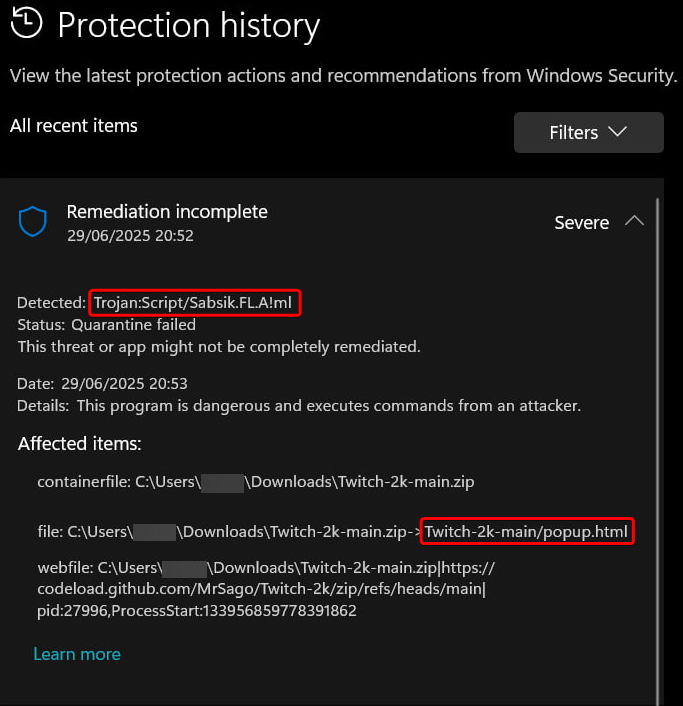

# Ваш антивирус обнаружил троян в расширении



Троян в [HTML](./popup.html) файле? Вы сами в это верите?

Virus total для версии [Twitch-2k-v1.3](https://www.virustotal.com/gui/file/8dee4c85a786751a251a0343773e20f2fb255417d865cfb345f60679f755f86e)

Параноики могут скачать расширение [версии 1.2](https://github.com/MrSago/Twitch-2k/releases/tag/v1.2)

## Анализ от Claude Sonnet 4

Windows Defender обнаружил потенциальную угрозу в HTML файле. Объясню, почему Windows Defender может срабатывать на этот HTML файл.

### Почему Windows Defender обнаружил угрозу

**Trojan:Script/Sabsik.FL.A!ml** - это эвристическое обнаружение машинного обучения, которое может срабатывать на легитимные файлы. В вашем случае это происходит по следующим причинам:

### 1. **Прокси-функциональность**

Расширение настраивает прокси-сервер для обхода блокировок Twitch. Антивирус может считать это подозрительным поведением, так как:

- Код работает с прокси (`azaska.ru:1050`)
- Есть разрешения на изменение прокси-настроек
- Расширение может перенаправлять трафик

### 2. **Конфигурация прокси в коде**

В файле [config.js](./config.js) жестко прописан прокси-сервер:

```javascript
DEFAULT_PROXY_ADDRESS: "azaska.ru",
DEFAULT_PROXY_PORT: "1050",
```

### 3. **Разрешения расширения**

В [manifest.json](./manifest.json) запрашиваются разрешения, которые могут показаться подозрительными:

- `"proxy"` - управление прокси
- `"storage"` - доступ к хранилищу
- `"alarms"` - планировщик задач

### ✅ **Это ложное срабатывание, если**

- Вы сами разрабатываете это расширение
- Загрузили его из надежного источника
- Код выглядит легитимно (что и есть на самом деле)

### 🔧 **Решения**

1. **Добавить в исключения**

   - Добавьте папку проекта в исключения Windows Defender
   - Или добавьте конкретный файл [popup.html](./popup.html)

2. **Проверить источник**

   - Убедитесь, что это оригинальное расширение Twitch 2k
   - Проверьте репозиторий на GitHub: [MrSago/Twitch-2k](https://github.com/MrSago/Twitch-2k)

3. **Временно отключить эвристику**
   - В настройках Windows Defender можно временно отключить обнаружение на основе ML

### ⚠️ **Важно**

Такие срабатывания типичны для инструментов обхода блокировок, VPN и прокси-утилит. Они не являются вирусами, но антивирусы могут считать их потенциально нежелательными программами (PUP).
